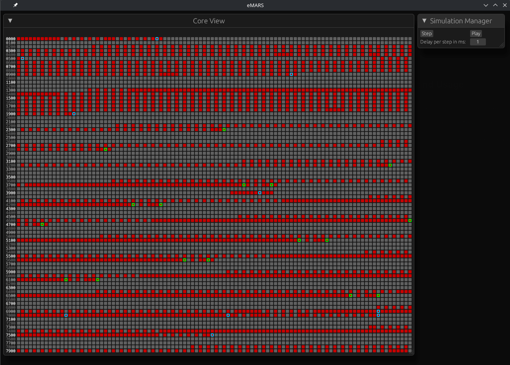

# eMARS

**A user-friendly Memory Array Redcode Simulator for getting into Corewar!**

## Installation and Usage

Clone the repository with `git`, install Rust, and run `cargo r -- [warrior1] [warrior2] [coresize]` in the repository.
If you're on Linux, you can just use the executable in the release.

The program can take in 3 arguments: the filepath to the first warrior, the filepath to the second, and the size of the core (optional). For example, you could run the program with `cargo r -- warriors/littlefactory.red warriors/scanner1.red 8000` to run two of the example warriors with a core of 8000 instructions.

Once in the program, use the step or play button to run the match! When using the play button, the match will stop automatically once there is only one warrior or once the step limit (coresize * 10) is reached.
You can use the slider below the play button to adjust the amount of milliseconds per each step when playing.

I've also included a complete guide to Redcode by Ilmari Karonen at [vyznev.net](https://vyznev.net/corewar/guide.html) in `Redcode Guide.pdf` as an easy way to begin learning about Redcode! (and since the site is now down, it also doubles as preservation) 

  

